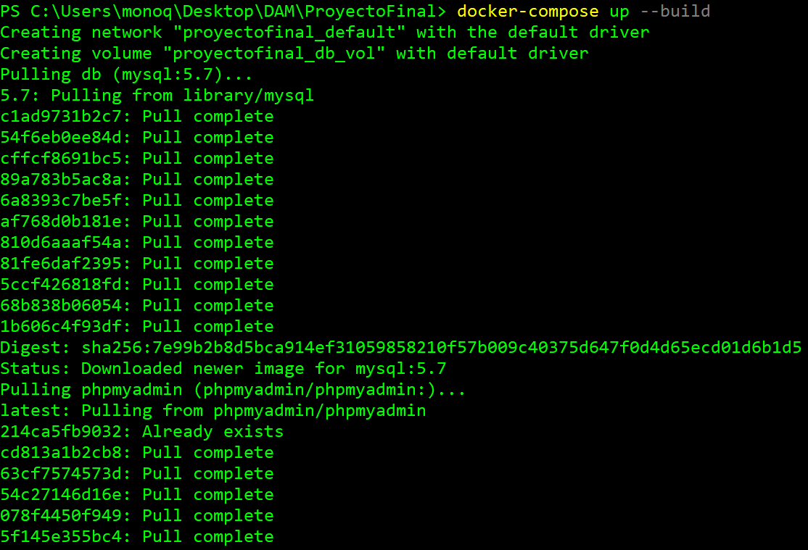
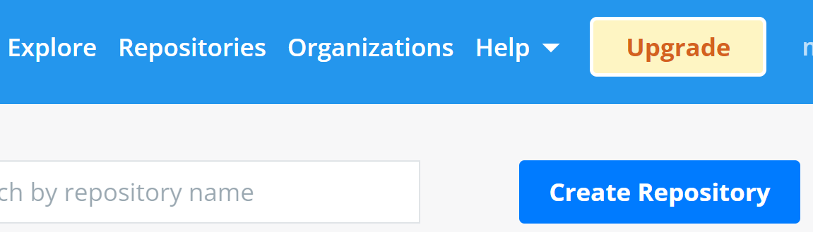
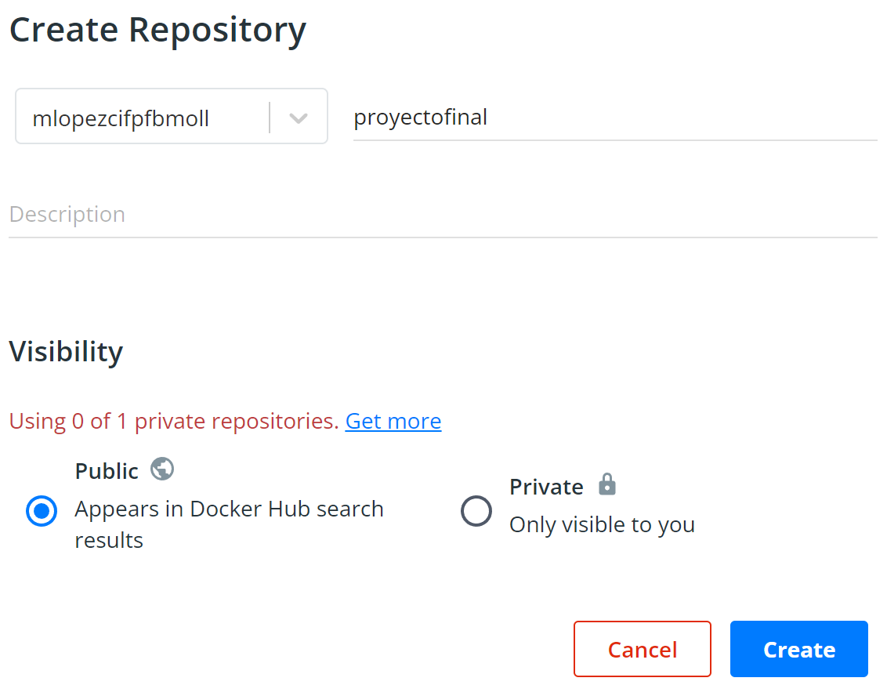
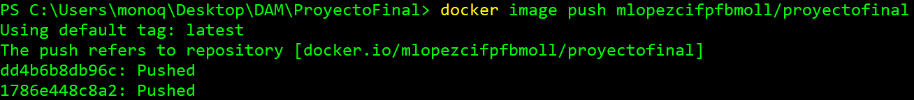
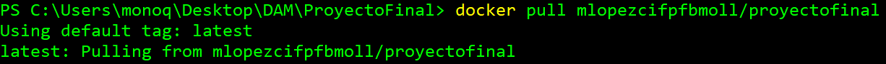
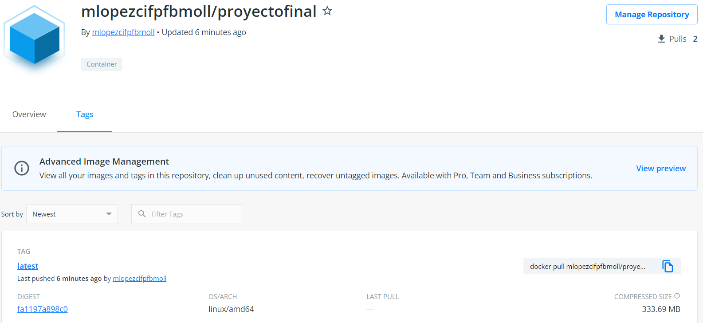
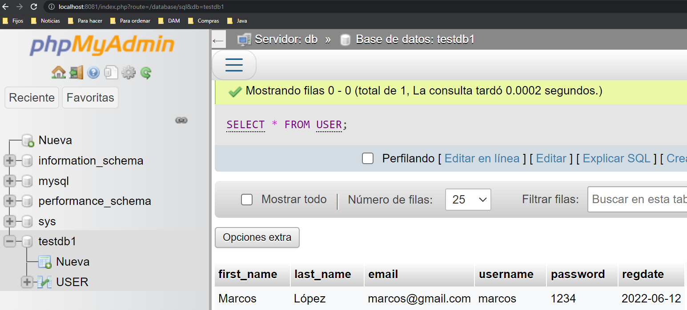

# Proyecto final: Docker-Compose

<details close>

<summary>Integrantes</summary>

*Marcos López de la Fuente*

*Erica Lisbeth Poaquiza Cango*

*Rafel Llull Pascual*

</details>

<details open>

<summary><span style="font-size:1.5rem">1. Introducción</span></summary>

---

Docker Compose es una herramienta que permite simplificar el uso de Docker. A partir de un `archivo.yml` es más sencillo crear contenedores, conectarlos, configurar puertos, etc.

Para hacer uso de esta herramienta desplegaremos una aplicación que haga uso de *Tomcat*, *MySQL*, *phpMyAdmin*. Cabe mencionar que se hará uso del proyecto facilitado por el docente, debido a que nuestra base de datos se realizó en *Oracle*.

</details>
<details open>

<summary><span style="font-size:1.5rem">2. Configuración de archivos</span>

</summary>

---

Para que el despliegue de la aplicación sea un éxito es necesario editar dos archivos.

### 2.1. Configuración [USER.sql](Docker-Compose/mysql-dump/USER.sql)

---

La tabla `USER` tiene un error debido a que le falta añadir la columna `regdate`, se editará el código mostrandose de la siguiente forma:

```sql
CREATE TABLE `USER` (
    `first_name` VARCHAR(20) NOT NULL,
    `last_name` VARCHAR(20) NOT NULL,
    `email` VARCHAR(20) NOT NULL,
    `username` VARCHAR(20) NOT NULL,
    `password` VARCHAR(20) NOT NULL,
    `regdate` DATE NOT NULL
) ENGINE=InnoDB DEFAULT CHARSET=latin1;
COMMIT;
```

### 2.2. Configuración [docker-compose.yml](Docker-Compose/docker-compose.yml)

---

Se debe añadir el servicio `publicar`, indicando el nombre de usuario y repositorio de [DockerHub](https://hub.docker.com/r/mlopezcifpfbmoll/proyectofinal), tal y como se muestra a continuación:

```yml
version: '3.3'
services:
   db:
     image: mysql:5.7
     volumes:
       - db_vol:/var/lib/mysql
       - ./mysql-dump:/docker-entrypoint-initdb.d
     environment:
       MYSQL_ROOT_PASSWORD: root
       MYSQL_DATABASE: testdb1
       MYSQL_USER: testuser
       MYSQL_PASSWORD: root
     ports:
       - 3306:3306
   phpmyadmin:
    depends_on:
      - db
    image: phpmyadmin/phpmyadmin
    ports:
      - '8081:80'
    environment:
      PMA_HOST: db
      MYSQL_ROOT_PASSWORD: root
   web:
    build:
      context: .       
    depends_on:
      - db
    image: tomcat
    volumes:
            - ./target/LoginWebApp.war:/usr/local/tomcat/webapps/LoginWebApp.war
    ports:
      - '8082:8080'
    environment:
      MYSQL_ROOT_PASSWORD: root
      MYSQL_DATABASE: testdb1
      MYSQL_USER: testuser
      MYSQL_PASSWORD: root

   # Se indica el "build" en el mismo directorio
   publicar:
    build: .
    # Nombre de usuario y repositorio separados por el carácter '/'
    image: mlopezcifpfbmoll/proyectofinal

volumes:
    db_vol:
```

</details>

<details open>
<summary><span style="font-size:1.5rem">3. Desplegar aplicación</span></summary>

---

Una vez configurados los archivos se debe realizar el siguiente comando desde la propia ubicación del archivo [docker-compose.yml](Docker-Compose/docker-compose.yml).

*Se deberá ejecutar el parámetro `--build` para crear la imagen con el nombre preparado en el archivo `docker-compose.yml`*

```bash
docker-compose up --build
```



</details>

<details open>
<summary><span style="font-size:1.5rem">4. Publicar imagen</span></summary>

---

Para subir una imágen a [DockerHub](https://hub.docker.com) es necesario hacer un par de pasos previos.

### 4.1. Crear repositorio

---

Se deberá crear un repositorio en [DockerHub](https://hub.docker.com) desde la sección `Repositories` pulsando en `Create Repository`.



*En este caso el nombre de usuario será `mlopezcifpfbmoll` con el repositorio `proyectofinal`.*



### 4.2. Subir imagen

---

Antes de subir la imagen se deberá iniciar sesión de la cuenta en DockerHub desde la terminal mediante el comando:

```bash
docker login
```

Tras iniciar sesión se podrá subir la imagen mediante el comando:

*El contenido seguido de `push` deberá ser igual al configurado en el archivo [docker-compose.yml](Docker-Compose/docker-compose.yml).*

```bash
docker image push mlopezcifpfbmoll/proyectofinal
```



Desde este momento se podrá acceder a la imagen desde la URL [https://hub.docker.com/r/mlopezcifpfbmoll/proyectofinal](https://hub.docker.com/r/mlopezcifpfbmoll/proyectofinal)

Debido a que el repositorio está público cualquier persona podrá descargar la imagen ejecutando el comando:

```bash
docker pull mlopezcifpfbmoll/proyectofinal
```



</details>

<details open>
<summary><span style="font-size:1.5rem">5. Comprobación del funcionamiento</span></summary>

---

La imagen fue subida a [DockerHub](https://hub.docker.com/r/mlopezcifpfbmoll/proyectofinal) correctamente tal y como se muestra en la siguiente imagen:



Para comprobar que el servicio *Tomcat* funciona de manera correcta, acudimos en nuestro navegador a la ruta `localhost:8082/LoginWebApp/register.jsp`, se nos deberia mostrar una pagina de registro donde ingresaremos datos del usuario:


Para comprobar que todo funciona correctamente podemos conectarnos a nuestro servidor "*phpMyAdmin*" escribiendo en el buscador `localhost:8081/index.php` y viendo que aparece el *login* de *phpMyAdmin*, ingresamos y en la seleccion de base de datos realizamos un select de la tabla `USER` y se mostrará los datos del usuario que se han introducido con anterioridad:



</details>

<details open>
<summary><span style="font-size:1.5rem">6. Annexos</span></summary>

---

La imágen creada se puede encontrar en el siguiente repositorio de [DockerHub](https://hub.docker.com):

[https://hub.docker.com/r/mlopezcifpfbmoll/proyectofinal](https://hub.docker.com/r/mlopezcifpfbmoll/proyectofinal)

Y se puede descargar con el siguiente comando:

```bash
docker pull mlopezcifpfbmoll/proyectofinal
```

</details>
